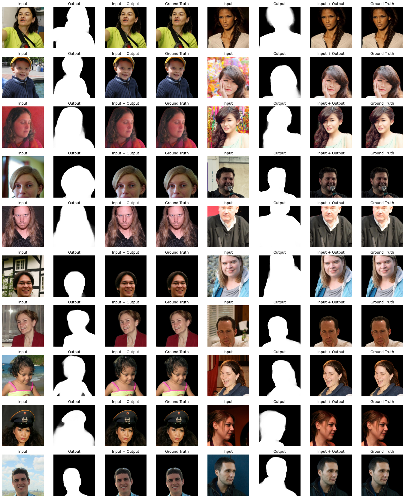
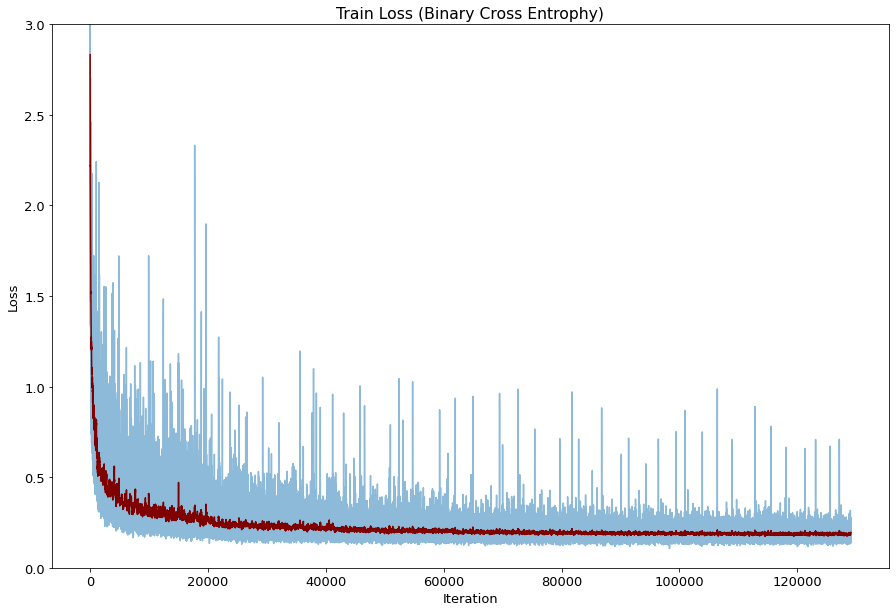
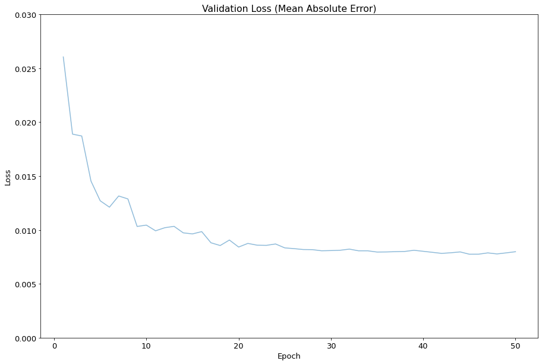
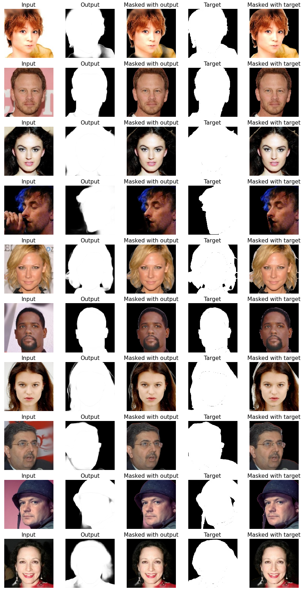
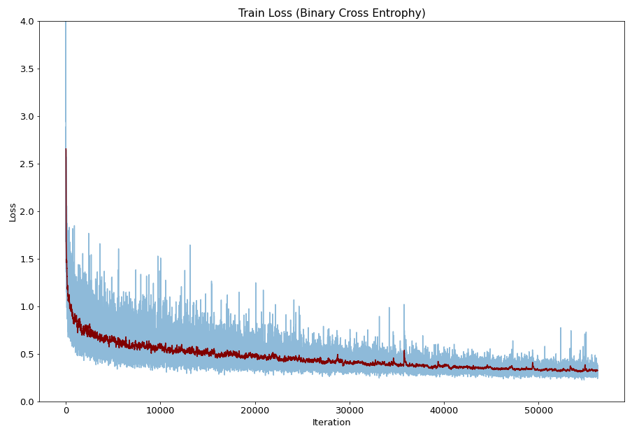

# U2-Net
A Pytorch implementation of [U2-Net: Going Deeper with Nested U−Structure for Salient Object Detection](https://arxiv.org/abs/2005.09007) trained with CelebAMask

<p align="center">
  
  
</p>

## 1. Train with Matting Human Dataset (2022.08.01)
I made a dataset and upload in Kaggle after pre-processing. ([288x384](https://www.kaggle.com/datasets/kimjiyeop/matting-human-288x384) & [216x288](https://www.kaggle.com/datasets/kimjiyeop/matting-human-216x288))  

### Implementation Details
```
augmentation: 288x384 → RandomHorizontalFlip → RandomCrop → 256x256
optimizer: Adam (learning rate = 1e-4) 
epoch: 25
loss weight: all 1
batch size: 12

train loss: binary cross entrophy
validation & test loss: mean absolute error (L1 loss)
```

### Output of test dataset images
<p align="center">
  
</p>

### Convert GIFs
<p align="center">
  
  
</p>
<p align="center">
  
  
</p>
<p align="center">
  
  
</p>

### Loss
#### Train loss
<p align="center">
  
</p>

#### Valid loss
<p align="center">
  
</p>
- minimum: 0.0077

#### Test loss
Mean absolute error for test images: 0.00806

## 2. Train with CelebAMask (2022.06.24)
I made a dataset and upload in Kaggle after pre-processing. ([128x128](https://www.kaggle.com/datasets/kimjiyeop/celeba-128-onlybg) & [256x256](https://www.kaggle.com/datasets/kimjiyeop/celeba-256-onlybg))  

### Implementation Details
```
image size: 128x128
optimizer: Adam (learning rate = 1e-3)
epoch: 25
loss weight: all 1
batch size: 12

train loss: binary cross entrophy
validation & test loss: mean absolute error (L1 loss)
```

### Output of test dataset images
<p align="center">
  
</p>

### Convert GIFs
<p align="center">
  
  
</p>

### Loss
#### Train loss
<p align="center">
  
</p>

#### Test loss
Mean absolute error for test images: 0.02649
